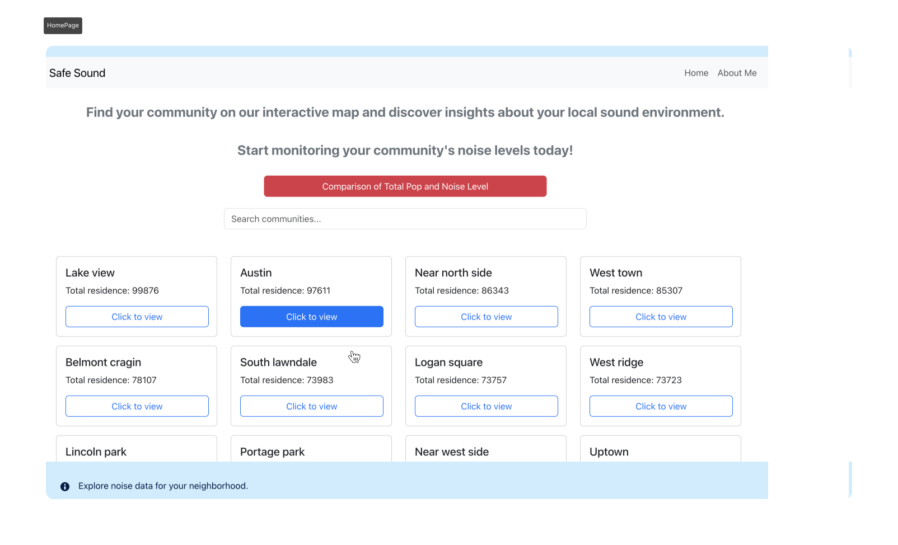

## Welcome to Smart Audio & Safe Listening in Chicago:

** With Smart Audio & Safe Listening you can visualize noise, population, and demographics across 77 Chicago communities!**
This project investigates potential correlations between noise levels and community characteristics. This PERN stack web app, built for a Google Code Next project, Builds understanding of urban sound and serves as a foundational step towards my personal vision of building my start-up **SafeSound**


<div align="center">

<a> 
</a>



**Quick Start**

[Overview](#Overview) | [Product Features](#Product-Features) | [instruction Manual](#instruction-manual) | [Wireframes](#Wireframes) | [User Stories](#User-Stories) | [Data Journey](#Data-Journey)

</div>


[//]: # (> 1. [Overview]&#40;#Overview&#41;)

[//]: # (> 1. [Product Features]&#40;#Product-Features&#41;)

[//]: # (> 2. [instruction Manual]&#40;#instruction-manual&#41;)

[//]: # (> 1. [Wireframes]&#40;#Wireframes&#41;)

[//]: # (> 1. [User Stories]&#40;#User-Stories&#41;)

[//]: # (>1. [Data Journey]&#40;#Data-Journey&#41;)

## Overview  

As part of my second term as a Student Engineer @ Google Code Next in the Engineering Practicum cohort by Coach Asim, we were tasked with developing an Interactive Web Application. This term we focused on building **autodidactic learning skills** and mastering our first stack **PERN stack** for web app development.

### Use case:
> [!TIP]
> *   **Analyze Chicago's Soundscape:** Explore noise levels, population, and demographics in 77 communities.
> *   **Investigate Auditory Enviorment:** Questions Answered:
    *   Does demographics & population impact noise levels in Chicago?
    *   Is the noise level in my community healthy?
    *   What does a Safe Noise Level look & Soundlike in my community?
> *   **Social Good:** Aims to address Noise-Induced Hearing Loss (NIHL).
  *Preventing 20% of NIHL could yield $123B+ in economic gain.*

## Product Features

Before creating my wireframes. I was tasked to only create 3 functional requirements. i finished with perosnalized all 3 UI designs bringing my web app to the market 2-3 weeks before due date, leaving time to improve and added complicated logic for me at the time like search functionality logic in the backend. 

>[!IMPORTANT]
>* as a **User** i can interact with a UI to choose which community **data analysis or visualization** i want to see so i can access the information i need.
>* as a **User** i must be able to view at least **3 data analyses and 2 different visualizations**. 
>  * as a **User** i can read an **"About Me"** page to learn about the web app's creator.

>➕ **Additional** 
> * As a **user**, I am able **audibly hear how loud specific decibel levels are** in different communities, so that I can better understand and compare the noise pollution impact beyond just seeing numbers on a chart.
> * As a **User**, I am able to navigate from the **"Compare All" page** to the community I'm most interested in.
> * As a **User**, I am able to search for my specific community on the home page.

## Instruction Manual
Assuming you've already cloned the repo:

```sh
cd frontend
npm install
npm start or npm start dev
```

then

```sh
cd backend
npm install
npm start or npm start dev
```

this is where i show you how to run it

## Wireframes

## User Stories

this is my business thesis

## Data-Journey

this is all the transfermations of the data & data credits

